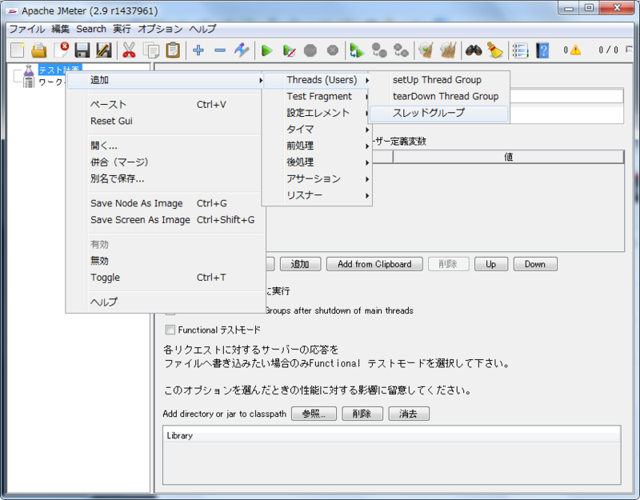
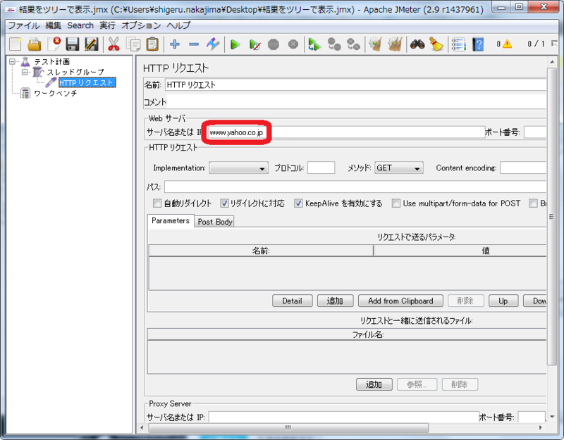
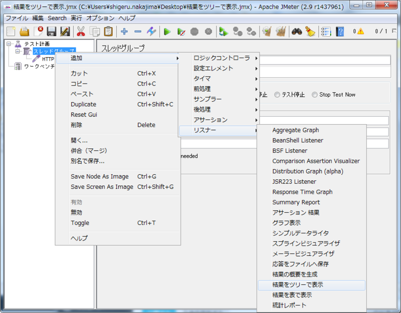
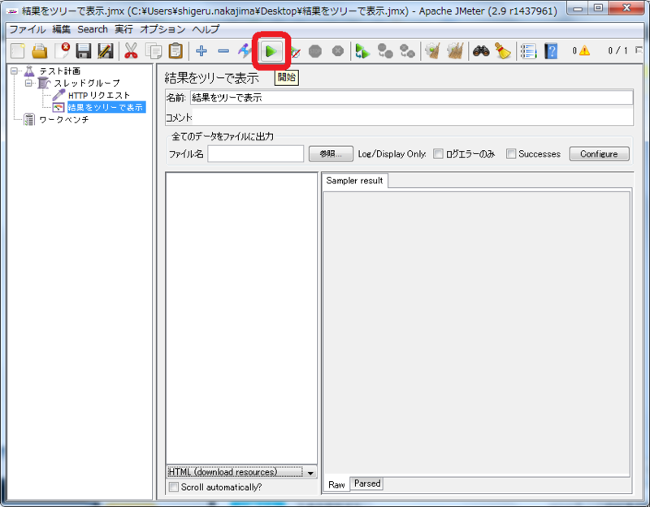
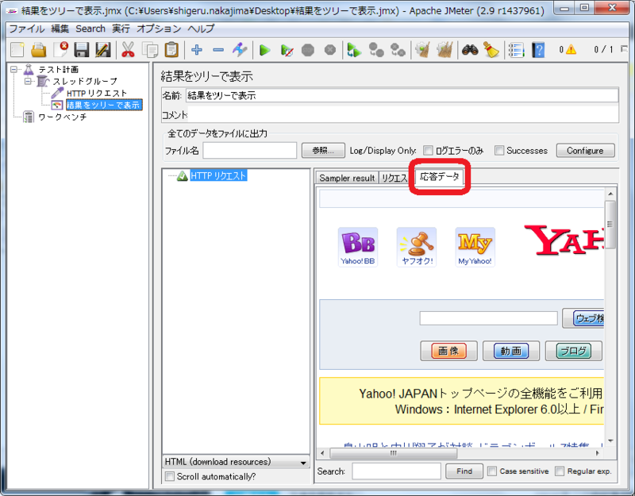

# JMeter でテストを実行する

JMeterで[Yahoo!JAPANのトップページ](http://www.yahoo.co.jp/)を取得するHTTPリクエストを生成します。 http://www.yahoo.co.jp にHTTPのGETリクエストを送ります。

# 使用コンポーネント

+ 「HTTP リクエスト」サンプラー
+ 「結果をツリーで表示」リスナー

# 前提
JMeterを起動していること。
起動できない場合は[起動する](1.start.md "起動する")を見てください。

# 手順
## 手順説明
1. スレッドグループを追加します
2. 「HTTP リクエスト」サンプラーを追加します
3. 「HTTP リクエスト」を設定します
4. 「結果をツリーで表示」リスナーを追加します
5. 「結果をツリーで表示」を設定します
6. テストを実行します
7. テストの実行結果を確認します

## 手順実施
### 1.スレッドグループを追加
[テスト計画]を右クリックして [追加] > [Threads(Users)] > [スレッドグループ] を選びます。

JMeterは負荷試験を行うツールです。同じ試験を

- 何回も繰り返す
- 複数のスレッドで実行して同時アクセスを再現する

ことができます。その試験の単位がスレッドグループです。サンプラー（リクエストを送るコンポーネント）をスレッドグループの下に置きます。

### 2.HTTP リクエストを追加
[スレッドグループ]を右クリックして [追加] > [サンプラー] > [HTTP リクエスト] を選びます。

JMeterではリクエストを送るコンポーネントを「サンプラー」と呼びます。HTTPリクエストを送るときは「HTTP リクエスト」を使います。

### 3.HTTP リクエストを設定
[HTTP リクエスト]を選択します。[サーバ名または IP]に www.yahoo.co.jp を入力します。

### 4.結果をツリーで表示を追加
[スレッドグループ]を右クリックして [追加] > [リスナー] > [結果をツリーで表示] を選びます。

実行した試験の結果を見るには「リスナー」というコンポーネントを使います。「結果をツリーで表示」を使うと「送ったリクエスト」、「受け取ったレスポンス」の中身を見ることができます。

### 5.結果をツリーで表示を設定
[結果をツリーで表示]の中央下部を[HTML(download resource)]に変えます。

受け取ったレスポンスは色々な形式で表示することが出来ます。ブラウザに一番近い形式で表示する設定にします。

### 6.テストを実行
緑色の三角形をクリックします。

テストを実行するとするとシナリオファイルの保存を促すダイアログが表示されます。
「はい」を選んで適当な名前を付けて保存をしても、「いいえ」を選んで保存しなくても構いません。

シナリオファイルを保存しなかった場合は、テストを実行する度に同じダイアログが表示されます。

### 7.実行結果を確認
[結果をツリーで表示]で実行結果を確認します。[HTTP リクエスト]を選び[応答データ]タブを選びます。

ブラウザと同様に受信したHTMLをレンダリングして表示します。