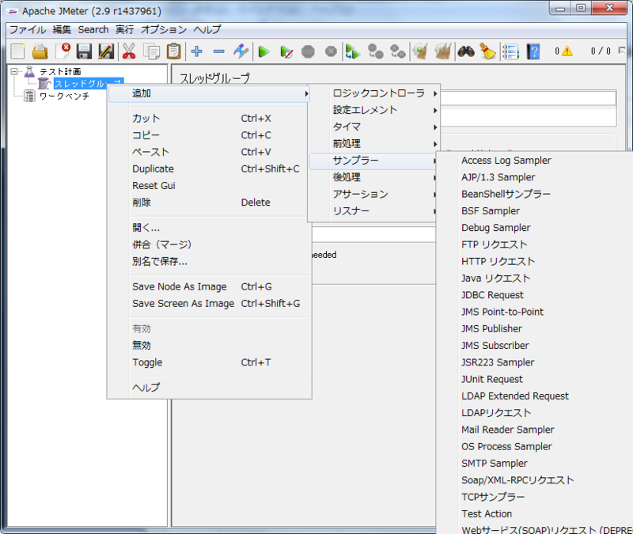
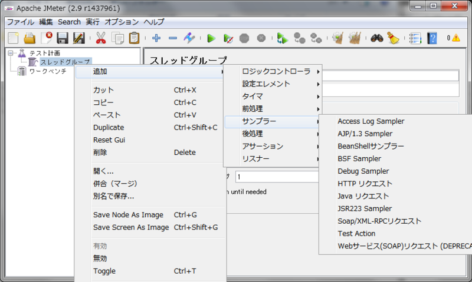

# JMeter の多すぎる機能（サンプラー）を減らす

JMeterは機能が多すぎるため使い慣れるまではどの機能を使えばよいのか迷います。使わないサンプラー（リクエストを送るコンポーネント）を無効にします。

## 前提
JMeterを起動していること。
起動できない場合は[起動する](1.start.md "起動する")を見てください。

## 手順
### 手順説明

1. JMeterの機能を確認します
2. lib/ext配下にunuseディレクトリを作成します
3. 使わない機能のjarを移動します
4. JMeterを起動します

### 手順実行
#### 1. JMeterの機能を確認

1. JMeterを起動します 
2. テスト計画を右クリックしてスレッドグループを追加します 
3. スレッドグループを右クリックしてサンプラーの一覧を表示します

バージョン2.9では初期状態で23個のサンプラーが登録されています。

#### 2. unuseディレクトリを作成
JMeterのディレクトリ内にlib/extと言うディレクトリがあります。
拡張をlib/extディレクトリに配置してJMeterを起動すると、自動的に認識されます。
この中にunuseディレクトリを作成します。

#### 3. 使わないサンプラーのjarを移動
lib/ext/unuseディレクトリに使わないサンプラーのjarを移動します。
JMeter起動中は移動できないのでJMeterを終了します。
「保存されていないテスト項目があります。テスト計画を消去する前に保存しますか？」と聞かれますが「いいえ」を選べば大丈夫です。

次のコンポーネントはあまり使わないので、unuseディレクトリに入れても大丈夫です。
必要になった時にlib/ext直下に戻して下さい。

- ApacheJMeter_ftp.jar
- ApacheJMeter_jdbc.jar
- ApacheJMeter_jms.jar
- ApacheJMeter_junit.jar
- ApacheJMeter_ldap.jar
- ApacheJMeter_mail.jar
- ApacheJMeter_monitors.jar
- ApacheJMeter_native.jar
- ApacheJMeter_tcp.jar

次の三つは必要ないとわかっていればunuseディレクトリに入れて下さい。

- ApacheJMeter_functions.jar
  - JMeter関数を使うために必要です
- ApacheJMeter_http.jar
  - 「HTTP リクエスト」サンプラーを使うために必要です
- ApacheJMeter_java.jar
  - 「Test Action」サンプラーを使うために必要です

#### 4. JMeterを起動
JMeterを再起動するとサンプラーが11個に減っているのが確認できます。

