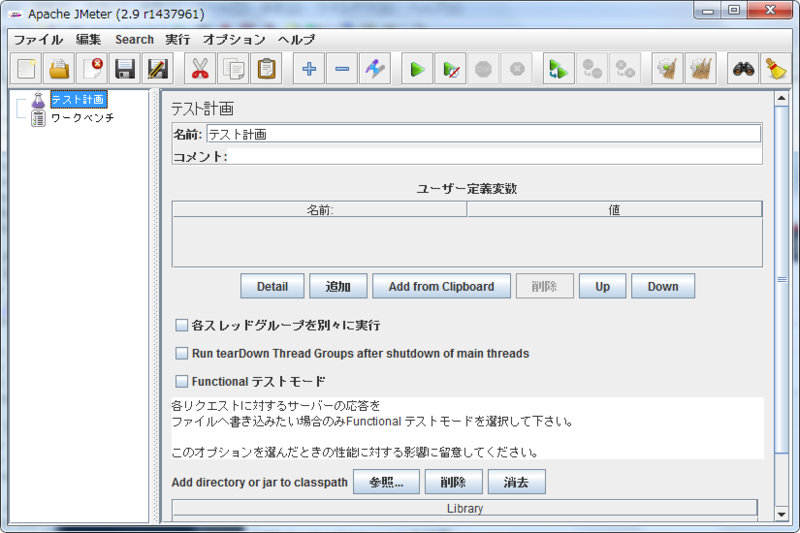
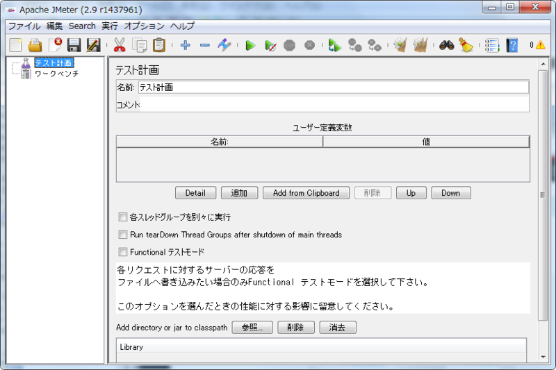
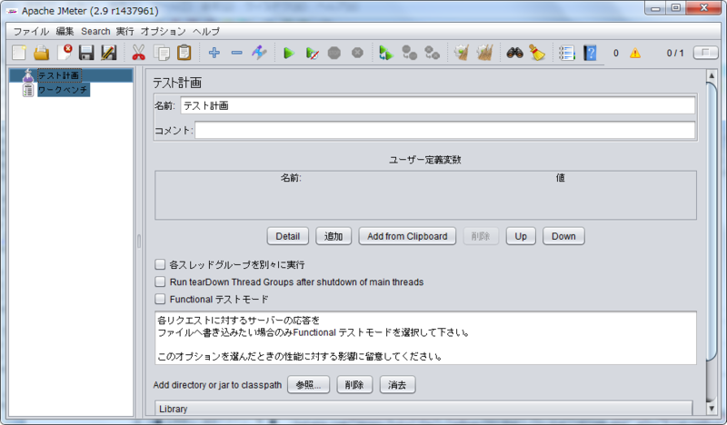

# JMeterの見た目を見慣れたものにする

JMeterの見た目の初期設定はMetalです。フォントが読みづらいのでルック&フィールを変更して見やすくします。

## 前提
JMeterを起動していること。
起動できない場合は[起動する](1.start.md "起動する")を見てください。

## 手順
### 手順説明

1. 初期設定のルック&フィールを確認します
2. ルック&フィールを変更します

### 手順実行
#### 1. 初期設定のルック&フィールを確認
JMeterのルック&フィールの初期設定は、なるべく多くの環境（OS）で実行できるようにMetalです。
しかし、Windows7でMetalを見ると

+ メニューのフォントが読みづらい
+ ボタンが見慣れない形をしている

という問題があります。

#### 2. ルック&フィールを変更
[オプション] > [ルック&フィール] > [System] を選択します。

見慣れた見た目に変わります。
Java SE 6 Update 10 以降であればNimbusが使えます。NimbusはOSが変わっても見た目が変わりません。こちらも便利です。

