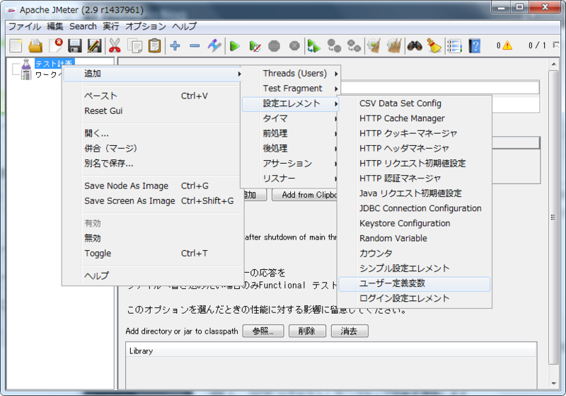
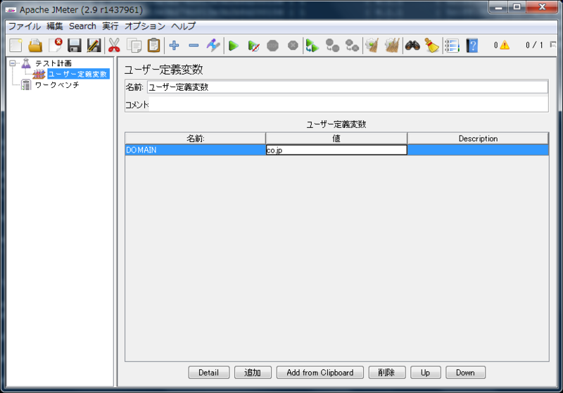
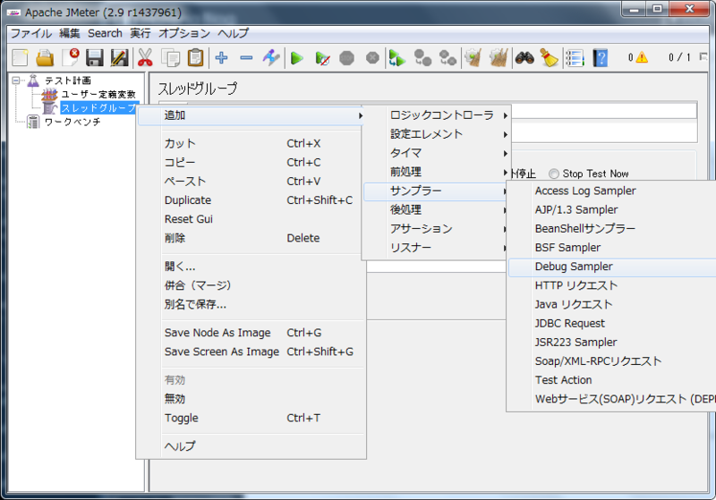
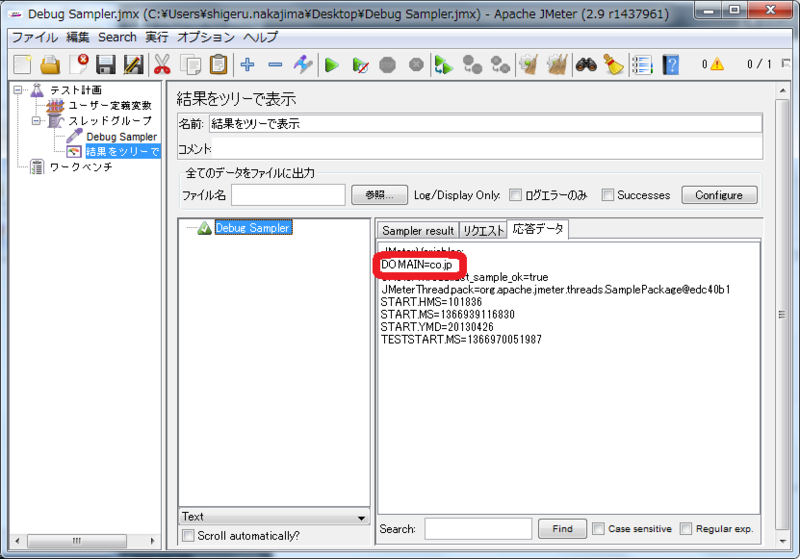
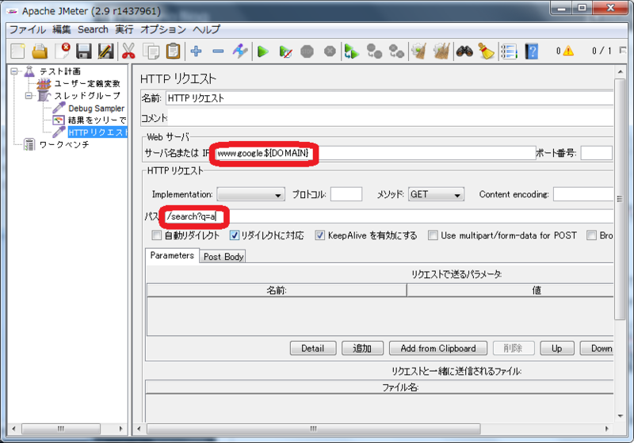
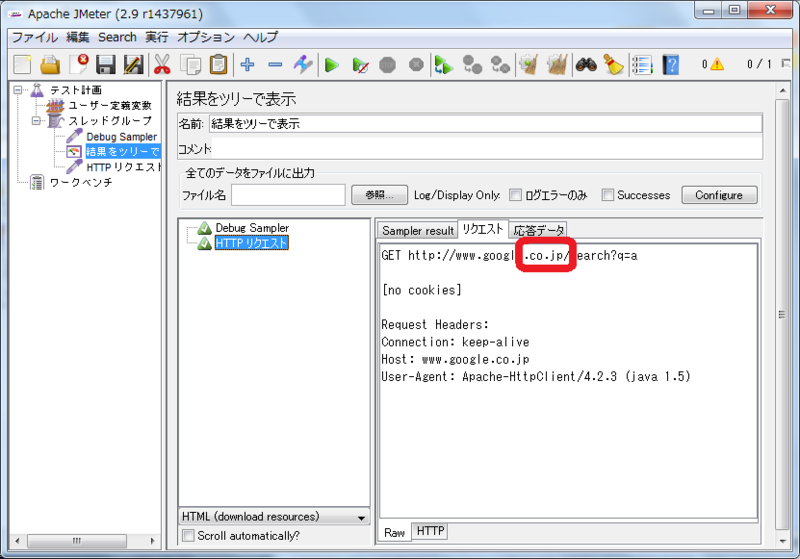
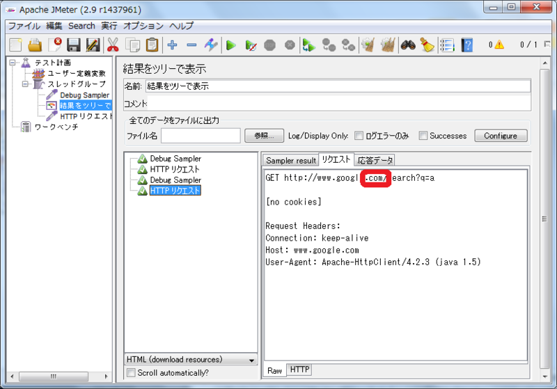

# JMeterで変数を定義する

試験対象のサーバーが二台ある場合など、シナリオの一部を変数として変更したいことがあります。「ユーザー定義変数」コンポーネントを使って変数を定義します。

今回は google.co.jp と google.com の二つのURLで検索を実行します。異なる部分（co.jpとcom）を変数で変更できるようにしましょう。

# 使用コンポーネント

+ 「ユーザ定義変数」設定エレメント
+ 「Debug Sampler」サンプラー
+ 「HTTP リクエスト」サンプラー
+ 「結果をツリーで表示」リスナー

## 前提
以下ができること

1. JMeterを起動する。
（[起動する](1.start.md "起動する")参照）
2. 「HTTP リクエスト」サンプラーを設定する。
（[テストを実行する](2.run.md "テストを実行する")参照）

## 手順
### 手順説明

1. 「ユーザ定義変数」設定エレメントを追加します
2. 「ユーザ定義変数」を設定します
3. 「Debug Sampler」サンプラーを追加します
4. 「Debug Sampler」で設定された変数を確認します
5. 「HTTP リクエスト」サンプラーで変数を使用します
6. テストを実行します
7. 変数を変更してテストを再実行します

### 手順実行
#### 1. 「ユーザ定義変数」設定エレメントを追加
[テスト計画]を右クリックして [追加] > [設定エレメント] > [ユーザー定義変数] を選びます。

#### 2. 「ユーザ定義変数」を設定
[ユーザー定義変数]を選択します。[追加]ボタンを押し、[名前]に DOMAIN [値]に co.jp を入力します。

#### 3. 「Debug Sampler」サンプラーを追加

1. [テスト計画]を右クリックして [追加] > [Threads(Users)] > [スレッドグループ] を選びます。
2. [スレッドグループ]を右クリックして [追加] > [サンプラー] > [Debug Sampler] を選びます。

「Debug Sampler」を使用すると設定された変数を確認することができます。サンプラーはスレッドグループにしか追加できません。先にスレッドグループを追加する必要があります。

#### 4. 「Debug Sampler」で設定された変数を確認

1. [スレッドグループ]を右クリックして [追加] > [リスナー] > [結果をツリーで表示] を選びます。
2. 緑色の三角形をクリックします。
3. [結果をツリーで表示]で実行結果を確認します。[Debug Sampler]を選び[応答データ]タブを選びます。

「DOMAIN=co.jp」という記述が確認できます。この表示があればサンプラーから変数を参照することができます。テスト実行の際にシナリオファイルの保存を促すダイアログが表示されます。「はい」を選んで好きなファイル名で保存してください。

#### 5. 「HTTP リクエスト」サンプラーで変数を使用

1. [スレッドグループ]を右クリックして [追加] > [サンプラー] > [HTTP リクエスト] を選びます。
2. [HTTP リクエスト]を選択します。[サーバ名または IP]に www.google.${DOMAIN} を[パス]に /search?q=a を入力します。

変数は${変数名}の形式で参照します。もし、指定した変数名が設定されていないと${変数名}のまま使われます。

#### 6. テストを実行します

1. 緑色の三角形をクリックします。
2. [結果をツリーで表示]で実行結果を確認します。[HTTP リクエスト]を選び[リクエスト]タブを選びます。

リクエストを送ったドメインがco.jpであることが確認できます。

#### 7. 変数を変更してテストを再実行

1. [ユーザー定義変数]を選択します。[名前]が DOMAIN [値]を com を入力します。
2. 緑色の三角形をクリックします。
3. [結果をツリーで表示]で実行結果を確認します。[HTTP リクエスト]を選び[リクエスト]タブを選びます。

リクエストを送ったドメインがcomであることが確認できます。