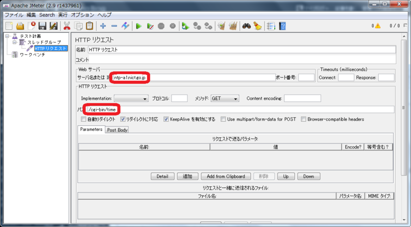
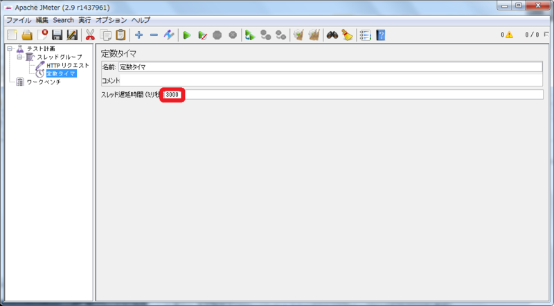
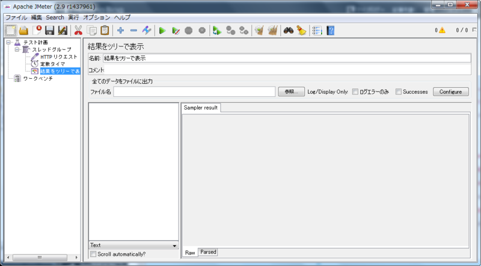
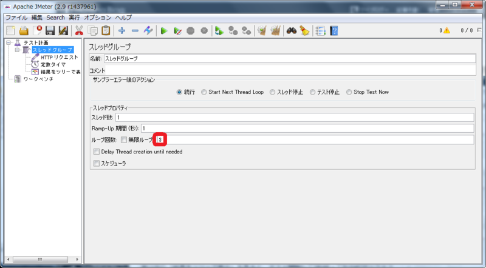
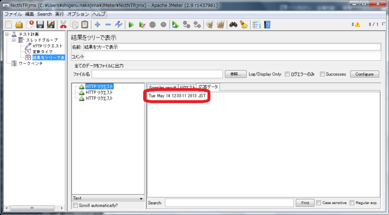

# JMeterで一定間隔でテストを実行する

負荷をかける際に一定の間隔をあけて負荷を掛けたいことがあります。

たとえば、NICTの公開しているNTPサーバには[HTTPインタフェース](http://www2.nict.go.jp/aeri/sts/tsp/PubNtp/clients.html)では

> ポーリング間隔は1時間平均で20回(あるいは1日平均で480回)を越えないようにしてください

と注意書きが記載されています。

今回は3秒間隔で現在時刻を取得するシナリオを作成します。

## 使用コンポーネント

+ 「定数タイマ」タイマ
+ 「HTTP リクエスト」サンプラー
+ 「結果をツリーで表示」リスナー

## 前提
以下ができること

1. JMeterを起動する。
（[起動する](1.start.md "起動する")参照）
2. 「HTTP リクエスト」サンプラーを設定する。
（[テストを実行する](2.run.md "テストを実行する")参照）

## 手順
### 手順説明

1. 「HTTP リクエスト」サンプラーを設定します
2. 「定数タイマ」タイマを設定します
3. 「結果をツリーで表示」リスナーを追加します
4. 「スレッドグループ」の「ループ回数」を設定します
5. テストを実行します
6. テスト結果を確認します

### 手順実行
#### 1. 「HTTP リクエスト」サンプラーを設定

1. [テスト計画]を右クリックして [追加] > [Threads(Users)] > [スレッドグループ] を選びます。
2. [スレッドグループ]を右クリックして [追加] > [サンプラー] > [HTTP リクエスト] を選びます。
3. [HTTP リクエスト]を選択します。[サーバ名または IP]に ntp-a1.nict.go.jp を[パス]に /cgi-bin/time を入力します。

#### 2. 「定数タイマ」タイマを設定

1. [スレッドグループ]を右クリックして [追加] > [タイマ] > [定数タイマ] を選びます。
2. [定数タイマ]を選択します。[スレッド遅延時間（ミリ秒）]に 3000 を入力します。

#### 3. 「結果をツリーで表示」リスナーを追加

1. [スレッドグループ]を右クリックして [追加] > [リスナー] > [結果をツリーで表示] を選びます。

#### 4. 「スレッドグループ」の「ループ回数」を設定

1. [スレッドグループ]を選択
2. [ループ回数]に 3 を入力します。

#### 5. テストを実行

1. 緑色の三角形をクリックします。
2. ダイアログが表示されるので[はい（Y)]を選び、chapter-6-1.jmx と名前を付けて保存します。

#### 6. テスト結果を確認

1. [結果をツリーで表示]で実行結果を確認します。
2. [HTTP リクエスト]を選び[応答データ]タブを選びます。
3. 実行した時刻が返ってきているのが確認できます。

テストの実行中に「結果をツリーで表示」を見ると、テスト開始から3秒経って最初のHTTPリクエストが送られるのが分かります。
これは「タイマ」コンポーネントを使っているからです。
「タイマ」コンポーネントは「同じ階層の全サンプラー」に起動するまでの待ち時間を設定します。
テストの途中で一回だけ待つには「Test Action」サンプラーを使います。

## シナリオファイル
[chapter-6-1.jmx](scenarios/chapter-6-1.jmx)