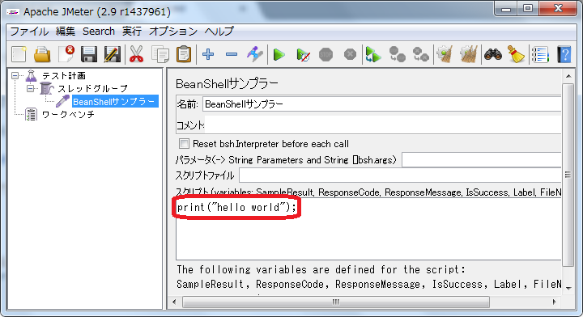

# BeanShellでデバッグプリントする

レスポンスから取得した値をデコードするなど、込み入った処理が必要なシナリオを書く時はBeanShellを使うと便利です。

しかしBeanShellは、文法エラーがjmeter.logに一行で表示されるためエラーが起きたことが分かりづらいです。
また、途中経過を確認するためにvaribaleに代入してDebugサンプラーで値を確認するのは不便です。

今回はBeanShellからコマンドプロンプトに値を表示するシナリオを作成します。

## 使用コンポーネント

+ 「BeanShellサンプラー」

## 前提
以下ができること

1. JMeterを起動する。
（[起動する](1.start.md "起動する")参照）

## 手順
### 手順説明

1. 「BeanShellサンプラー」を設定します
1. テストを実行します
1. 出力結果を確認します

### 手順実行
#### 1. 「BeanShellサンプラー」を設定

1. [テスト計画]を右クリックして [追加] > [Threads(Users)] > [スレッドグループ] を選びます。
2. [スレッドグループ]を右クリックして [追加] > [サンプラー] > [BeanShellサンプラー] を選びます。
3. [BeanShellサンプラー]を選択します。[スクリプト]に print("hello world"); を入力します。

#### 2. テストを実行

1. 緑色の三角形をクリックします。
2. ダイアログが表示されるので[はい（Y)]を選び、chapter-7-1.jmx と名前を付けて保存します。

#### 3. 出力結果を確認

1. コマンドプロンプトで出力結果を確認します。

「hello world」と出力されているのが分かります。

## シナリオファイル
[chapter-7-1.jmx](scenarios/chapter-7-1.jmx)