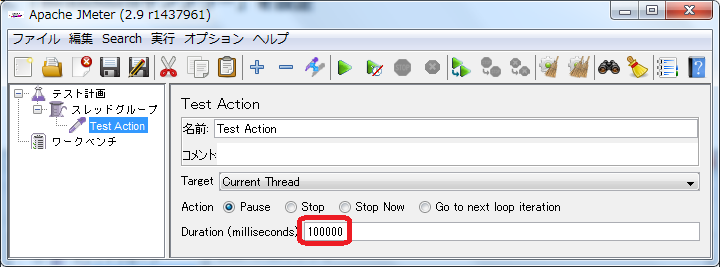
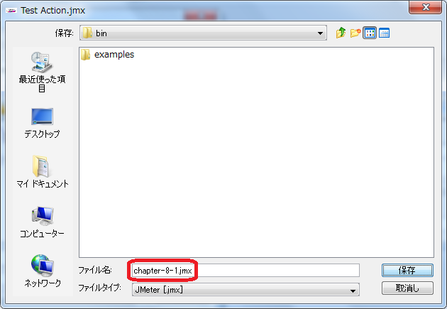

# コマンドラインで実行する

以下のような場合にコマンドラインから実行したいことがあります。

+ GUIをインストールしていないLinuxサーバで実行
+ スクリプトから起動する

今回はコマンドラインから起動・終了するシナリオを作成します。

## 使用コンポーネント

+ 「TestAction」サンプラー

## 前提
以下ができること

1. JMeterを起動する。
（[起動する](1.start.md "起動する")参照）

## 手順
### 手順説明

1. 「TestAction」サンプラーを設定します
1. シナリオを保存します
1. コマンドラインから起動します
1. コマンドラインから終了します

### 手順実行
#### 1. 「TestAction」サンプラーを設定

1. [テスト計画]を右クリックして [追加] > [Threads(Users)] > [スレッドグループ] を選びます。
2. [スレッドグループ]を右クリックして [追加] > [サンプラー] > [TestAction] を選びます。
3. [TestAction]を選択します。[Duration]に 100000 を入力します。



#### 2. シナリオを保存

1. フロッピーディスクアイコンをクリックします。
1. ダイアログが表示されるので chapter-8-1.jmx と名前を付けて保存します。



#### 3. コマンドラインから起動

1. コマンドプロンプトを起動し、次のコマンドを実行します。

```
apache-jmeter-2.9\bin\jmeter.bat -n -t chapter-8-1.jmx
```


起動メッセージが表示されます。

linuxの場合は次のコマンドを使ってください
```
apache-jmeter-2.9/bin/jmeter -n -t chapter-8-1.jmx
```

#### 4. コマンドラインから終了

1. もう一つコマンドプロンプトを起動し、次のコマンドを実行します。

```
apache-jmeter-2.9\bin\shutdown.cmd
```


最初のコマンドプロンプトに終了メッセージが表示されます。

linuxの場合は次のコマンドを使ってください
```
apache-jmeter-2.9/bin/shutdown.sh
```

## シナリオファイル
[chapter-8-1.jmx](scenarios/chapter-8-1.jmx)